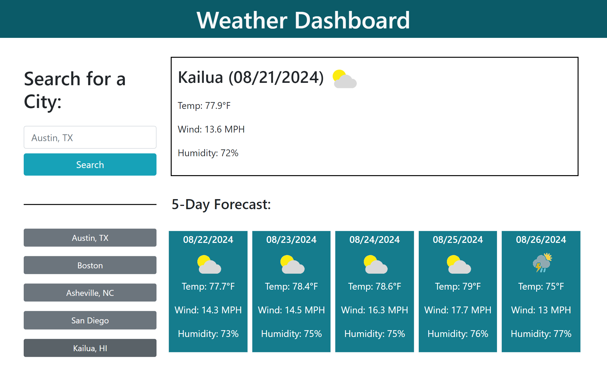
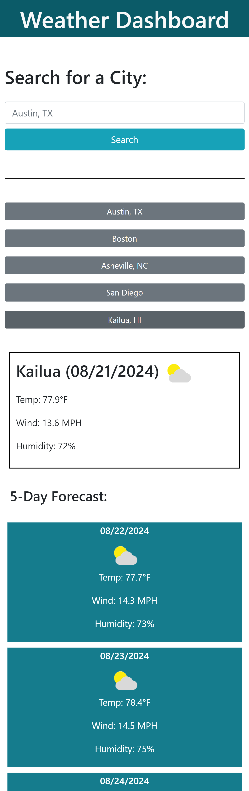

# Ivory-Weather-Dashboard

A weather dashboard that provides current weather and 5-day forecasts for any city, featuring dynamically updated weather data, including temperature, wind speed, humidity, and weather icons.

## Table of Contents

- [Key Features](#key-features)
- [Built With](#built-with)
- [Usage](#usage)
- [Screenshot](#screenshot)
- [Contributing](#contributing)
- [Questions](#questions)

## Key Features

- **Real-Time Weather Data**: Fetches and displays up-to-date weather information for any city.
- **5-Day Forecast**: Displays a detailed 5-day weather forecast with daily icons, temperature, wind speed, and humidity.
- **Search History**: Saves previously searched cities, allowing users to quickly access past searches.
- **Responsive Design**: Fully responsive layout that adapts to different screen sizes, ensuring a smooth user experience on both desktop and mobile devices.

## Built With

- **HTML & CSS**: Structure and styling of the user interface.
- **JavaScript**: Dynamic content updates and API interaction.
- **Day.js**: Handling and formatting dates for weather forecasts.
- **Bootstrap**: Responsive layout and streamlined grid system.
- **Weatherbit API**: Fetching weather data including icons, temperatures, wind speeds, and humidity levels.

## Usage

1. **Navigate to the Application:**

   - Open your browser and go to: [Ivory Weather Dashboard](https://ivoryrines.github.io/Ivory-Weather-Dashboard/).

2. **Search for a City:**

   - Enter the name of the city (or city and state) you want to check the weather for into the search input box. It will accept the city name alone, but if there are multiple cities with the same name in the US, you should add a comma followed by the State name or abbreviation. See acceptable formats below:
     - "Austin"
     - "Austin, TX"
     - "Austin, Texas"
   - Click the **"Search"** button to fetch and display the current weather and 5-day forecast.

3. **View Weather Data:**

   - The current weather is displayed at the top.
   - Below, the 5-day forecast provides daily weather details.

4. **Search History:**

   - Previously searched cities are saved and displayed below the search box. Click on a city to quickly view its weather data again.

5. **Responsive Design:**
   - The application is designed to work well on various screen sizes, with the 5-day forecast stacking vertically on smaller screens for easier viewing.

Feel free to explore the application and stay informed about the weather in your favorite cities!

## Screenshot

Screeshots of the completed application in desktop and mobile view to demonstrate functionality:

 

 

## Contributing

Contributions to Ivory Weather Dashboard are welcomed and appreciated! If you encounter bugs, please report them via GitHub issues, providing detailed steps to reproduce. For suggestions or feature enhancements, open an issue to discuss ideas. When contributing code, fork the repository, create a new branch, and submit a pull request to the main branch. Ensure your changes adhere to project coding style and conventions. Please follow the project's Code of Conduct, and note that all contributions are licensed under the MIT License. Thank you for your contributions!

## Questions

Please reach out to me with any questions about this project via:

- [GitHub](https://github.com/IvoryRines)

- [Email](replays_flyers_0q@icloud.com)
